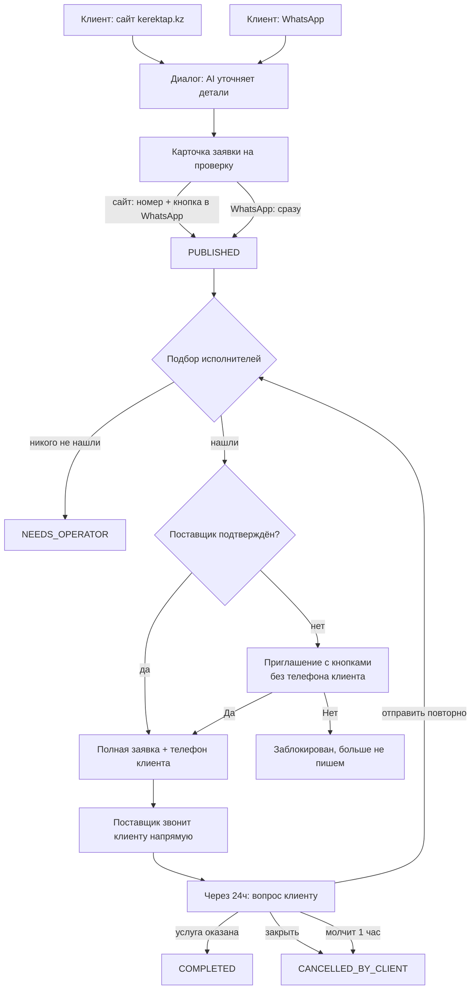
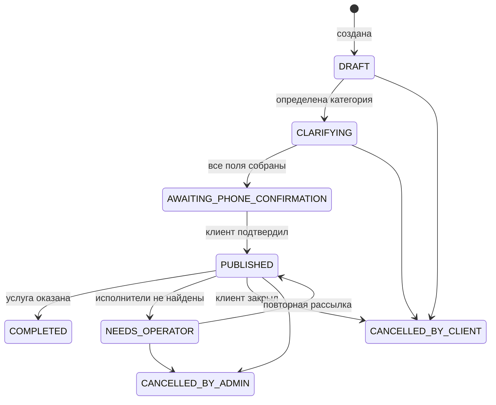
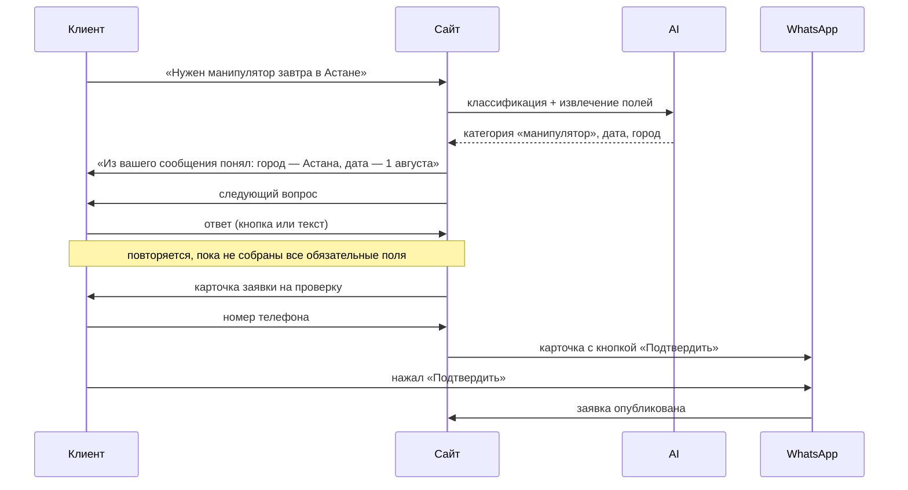
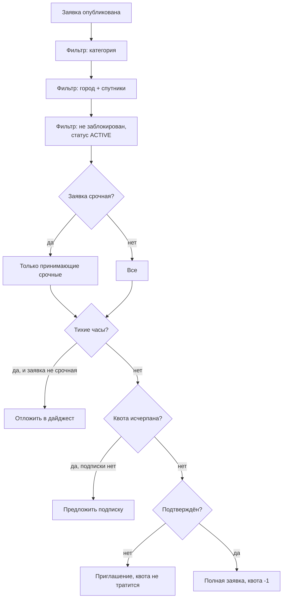
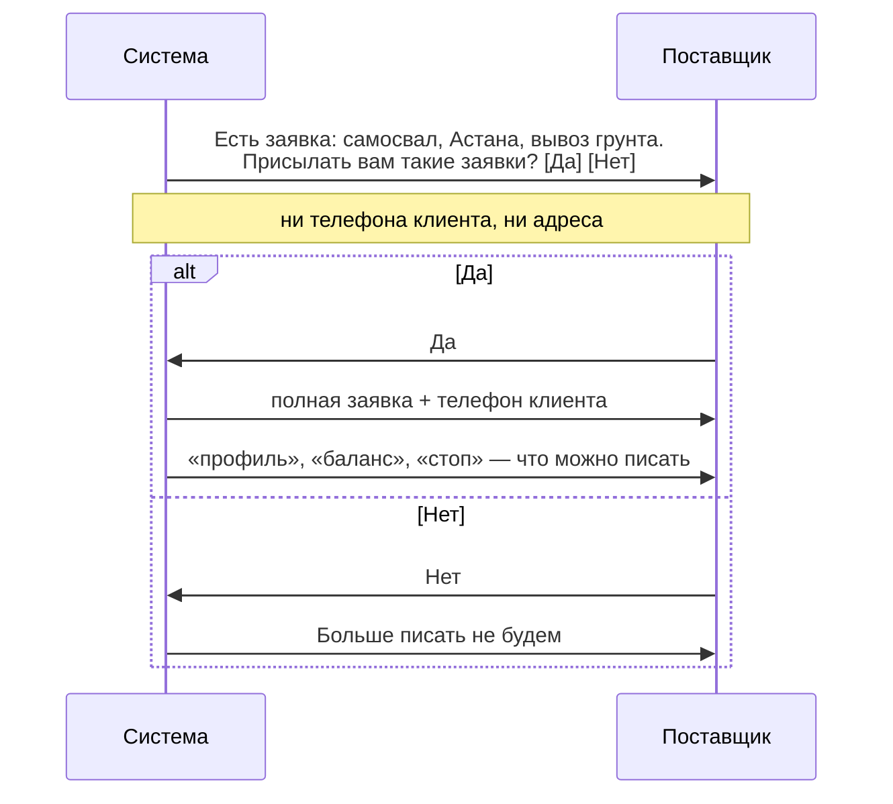

# KerekTap — как работает сервис

Справочник по реально запрограммированной логике: команды, статусы, правила
рассылки, схемы взаимодействия. Описывает то, что есть в коде, а не замысел.

Актуально на август 2026.

---

## 1. Что делает сервис

Клиент описывает задачу. Система уточняет детали, собирает структурированную
заявку и рассылает её подходящим исполнителям вместе с телефоном клиента.
Дальше стороны договариваются напрямую.

Сервис **не** берёт комиссию, не проводит платежи, не проверяет исполнителей
и не гарантирует отклик. Из этого следует главное архитектурное свойство:
после рассылки система не знает, что произошло, и узнаёт об этом только если
клиент сам ответит на вопрос через сутки.

---

## 2. Общая схема

---

## 3. Статусы заявки

Переходы, которых нет в схеме, API отклоняет.

**`NEEDS_OPERATOR` не означает «ждёт оператора».** Оператора в системе нет.
Статус значит буквально «не нашли подходящих исполнителей», и клиенту так и
пишут. Название осталось историческим.

---

## 4. Путь клиента

### 4.1 Через сайт

**Кода из SMS нет.** Нажатие кнопки приходит вебхуком с самого номера — это
доказывает владение сильнее, чем код, который можно прочитать с чужого
экрана. SMS остаётся запасным путём для номеров без WhatsApp.

Ограничение: не более 5 запросов подтверждения на один номер в сутки.

### 4.2 Через WhatsApp

Тот же диалог, но публикация **без отдельного подтверждения** — номер уже
доказан тем, что сообщение пришло именно с него.

### 4.3 Что видит клиент

- Свои ответы в переписке — включая выбранные кнопками
- Что система поняла из текста сама: «Из вашего сообщения понял: …»
- Город показывается как введён («Алмата»), хотя хранится канонический
  («Алматы») — переписка не переписывает сказанное человеком

---

## 5. Подбор исполнителей

**Города со спутниками.** Заявка из Косшы доходит до поставщиков Астаны,
из Талгара и Каскелена — до Алматы. Односторонне: базирующийся в спутнике не
считается покрывающим весь мегаполис.

**Опечатки прощаются.** «Алмата», «Чимкент», «Нур-Султан», «Кустанай» и
латиница приводятся к канону. Нераспознанный город не сохраняется — клиента
переспрашивают.

**Размер волны** — до 15 получателей на заявку (`DISPATCH_WAVE_SIZE`).

**Тихие часы** — по умолчанию с 21:00 до 08:00 (`Asia/Almaty`). Срочные
заявки уходят всё равно; несрочные копятся и утром приходят одним дайджестом.

---

## 6. Поставщик

### 6.1 Как попадает в базу

| Путь | Что происходит |
|---|---|
| Загружен админом | Ложится **холодным**, ждёт первой заявки |
| Написал сам в WhatsApp | Проходит регистрацию, сразу активен |
| Нажал «Да» на приглашении | Становится подтверждённым |

### 6.2 Холодное приглашение

Приглашение **не тратит квоту** и **не отправляется в тихие часы** вообще —
даже для срочных заявок.

### 6.3 Команды поставщика

Работают в любой момент, совпадение должно быть точным по всему сообщению.

| Команда | По-казахски | Что делает |
|---|---|---|
| `профиль`, `помощь`, `меню`, `команды` | `көмек`, `мәзір` | Категории, города, квота, статус рассылки |
| `поставщик`, `регистрация`, `я поставщик`, `стать исполнителем`, `мои услуги` | `жеткізуші`, `тіркелу`, `орындаушы болу` | Регистрация или изменение профиля |
| `баланс`, `мой баланс`, `подписка` | — | Уведомления и подписка |
| `стоп`, `отписаться`, `не писать`, `не присылать` | `тоқта`, `жазбаңыз` | Отключить рассылку |
| `возобновить`, `включить рассылку`, `старт` | `жалғастыру`, `қосу` | Включить обратно |
| `новая заявка` | `жаңа өтінім` | Заказать услугу для себя |

Отписка ставит статус `PAUSED`, а не блокировку: блокировка — наказание от
администратора, пауза — временный выход по своей воле.

Любое **нераспознанное** сообщение от зарегистрированного поставщика больше
не превращается в заявку — бот отвечает списком команд.

### 6.4 Что видит поставщик

Заявку — один раз, в момент прихода. Ссылка `/s/<id>` из того же сообщения
открывает карточку без входа. **Списка всех своих заявок нет.**

---

## 7. Завершение заявки

Через 24 часа после публикации клиенту приходит вопрос с тремя кнопками:

| Кнопка | Результат |
|---|---|
| Услуга оказана | `COMPLETED` |
| Отправить повторно | Новая волна рассылки |
| Закрыть заявку | `CANCELLED_BY_CLIENT` |

Молчание в течение часа — автоматическое закрытие. Эскалации к человеку нет:
платформа только соединяет и не гарантирует поставку.

---

## 8. Деньги

| Параметр | Значение |
|---|---|
| Для клиентов | Бесплатно |
| Бесплатных уведомлений исполнителю | 10 в месяц |
| Подписка | 5 000 ₸ на 30 дней |

Квота считается **на поставщика целиком**, а не на категорию. Работающий в
двух категориях расходует её вдвое быстрее.

Квота тратится на полной рассылке и **не тратится** на холодном приглашении.
Счётчик обнуляется первого числа.

Подтверждение оплаты требует подписи в заголовке и идемпотентно: повторный
вызов не продлевает подписку второй раз.

---

## 9. Сообщения WhatsApp

Meta пропускает свободный текст только **внутри 24 часов** с последнего
сообщения человека. Вне окна — только заранее одобренные шаблоны.

| Шаблон | Кому | Когда |
|---|---|---|
| `order_broadcast_full_v2` | Поставщику | Новая заявка |
| `order_digest_v2` | Поставщику | Утром после тихих часов |
| `supplier_cold_invite` | Поставщику | Первое касание, с кнопками |
| `prospect_outreach` | Поставщику | Прогрев, двуязычный |
| `completion_checkin_v2` | Клиенту | Через 24ч после публикации |
| `order_confirm_request` | Клиенту | Подтверждение заявки с сайта |

Все, кроме `prospect_outreach`, существуют в двух языковых версиях.

**Текст шаблона фиксируется при одобрении.** Меняются только значения
переменных. Кнопки и их подписи тоже зафиксированы — динамический только
идентификатор нажатия. Поэтому любая правка текста — это новый шаблон с
новым именем и повторная модерация.

---

## 10. Язык

Определяется автоматически по буквам, которых нет в русском алфавите:
`ә ғ қ ң ө ұ ү һ і`. Достаточно одной.

Явное переключение: `по-русски`, `на русском`, `русский` / `қазақша`,
`қазақ тілінде`. Выбор сохраняется и действует и в WhatsApp, и на сайте.

По умолчанию — русский.

---

## 11. Админка

- Очереди заявок: активные, без исполнителей, отменённые
- Повторная рассылка и отмена
- Список поставщиков, блокировка, ручная выдача подписки
- Массовая загрузка поставщиков из таблицы
- Настройки рассылки: размер волны, тихие часы

**Массовая загрузка** принимает по строке на пару «телефон + категория»,
группирует их по телефону и по умолчанию работает **вхолостую** — сначала
отчёт, запись только после подтверждения.

---

## 12. Эксплуатация

**Резервные копии** — ежедневно в 03:23. База хранится 30 дней, фотографии
14. Восстановление проверено сверкой с боевой базой. Копии лежат на той же
машине: защищают от порчи данных, но не от потери сервера.

**Сертификат** обновляется ежедневной задачей в 04:17.

**Провайдеры** переключаются переменными окружения: `WHATSAPP_PROVIDER`,
`SMS_PROVIDER`, `AI_PROVIDER`, `PAYMENT_PROVIDER`, `STORAGE_PROVIDER`.

---

## 13. Чего система не знает

Это следствие модели, а не недоработка:

- **Позвонил ли поставщик клиенту.** Единственный источник — ответ клиента на
  суточный вопрос, а отвечает меньшинство.
- **Как прошёл разговор**, какую цену назвали, состоялась ли сделка.
- **Кто именно выполнил заказ.** Привязки завершённой заявки к поставщику
  нет, рейтинг и счётчик выполненных не пересчитываются.

Поэтому качество работы измеряется косвенно: доля заявок без исполнителей,
доля брошенных диалогов, отписки, повторные обращения клиентов — и прямым
обзвоном клиентов, который метрики не заменяют.
